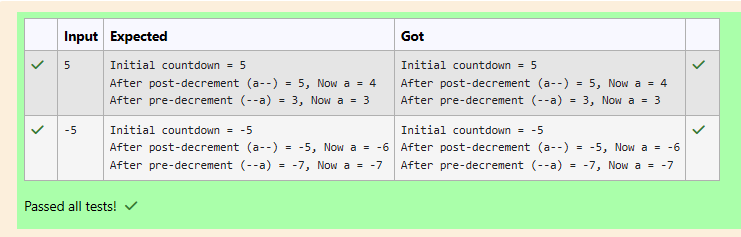

# # Ex.No:1(A) INTRODUCTION TO JAVA PROGRAMMING, DATA TYPES, VARIABLES AND OPERATORS 

## QUESTION:

Lovely is preparing a countdown for her rocket launch game. She has a starting number and wants to understand how subtracting with `--` works in Java.

Post-decrement (a--) → value is used first, then decreased  
Pre-decrement (--a) → value is decreased first, then used  

Write a Java program to:
- Take a countdown number as input  
- Apply both post-decrement and pre-decrement  
- Display how the value changes in each case  

## AIM:

To write a Java program to demonstrate the difference between post-decrement and pre-decrement operators.

## ALGORITHM :
1.	Start the program.
2.	Import the necessary package 'java.util'
3. Read an integer value from the user.  
4. Display the initial value of the variable.  
5. Apply post-decrement (a--) and store the result.  
6. Display the value used and updated value of `a`.  
7. Apply pre-decrement (--a) and store the result.  
8. Display the value used and updated value of `a`.  
9. Stop the program.  


## PROGRAM:
 ```
/*
Program to implement a conditional statement using Java
Developed by: SANTHOSE AROCKIARAJ J
RegisterNumber: 212224230248
*/
```

## SOURCE CODE:

```java

import java.util.*;

public class DECREMENT {
    public static void main(String[] K) {
        Scanner obj = new Scanner(System.in);

        int a = obj.nextInt();

        System.out.println("Initial countdown = " + a);

        int pos = a--;
        System.out.printf("After post-decrement (a--) = %d, Now a = %d\n", pos, a);

        int pre = --a;
        System.out.printf("After pre-decrement (--a) = %d, Now a = %d\n", pre, a);
    }
}
```


## OUTPUT:



## RESULT:

Thus, the Java program to demonstrate post-decrement and pre-decrement operators was executed successfully and verified with both positive and negative inputs.