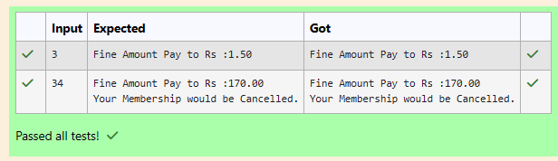

# Ex.No:1(B) CONDITIONAL STATEMENT

## QUESTION:

A library charges a fine for every book returned late. For first 5 days the fine is 50 paise, for 6-10 days fine is one rupee and above 10 days fine is 5 rupees. If you return the book after 30 days your membership will be cancelled - Print ("Your Membership would be Cancelled.")

Write a program to accept the number of days the member is late to return the book and display the fine or the appropriate message

## AIM:

To write a Java program to calculate the library fine based on delayed days using conditional statements.


## ALGORITHM :
1. Start the program  
2. Create a Scanner object to read input  
3. Read the number of delayed days  
4. Declare a variable fine  
5. If days ≤ 5, fine = days × 0.50  
6. Else if days ≤ 10, fine = days × 1.00  
7. Else, fine = days × 5.00  
8. Display the fine amount  
9. If days > 30, display membership cancellation message  
10. Stop the program  


## PROGRAM:
 ```
/*
Program to implement a conditional statement using Java
Developed by: SANTHOSE AROCKIARAJ J
RegisterNumber:  212224230248
*/
```

## SOURCE CODE:


## Sourcecode.java:
```java
import java.util.*;

public class LibraryFine {
    public static void main(String[] args) {
        Scanner sc = new Scanner(System.in);
        int days = sc.nextInt();
        double fine;

        if (days <= 5) {
            fine = days * 0.50;
        } else if (days <= 10) {
            fine = days * 1.00;
        } else {
            fine = days * 5.00;
        }

        System.out.printf("Fine Amount Pay to Rs :%.2f%n", fine);

        if (days > 30) {
            System.out.println("Your Membership would be Cancelled.");
        }
    }
}

```


## OUTPUT:



## RESULT:

Thus, the Java program to calculate the library fine based on delayed days was executed successfully.