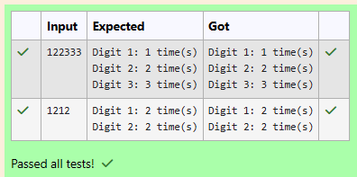

# Ex.No:1(C) LOOPING STATEMENT

## QUESTION:

Counting the frequency of digits in a number means determining how many times each digit (0–9) appears in that number.

For example, in the number 1123451:
- Digit 1 appears 3 times  
- Digit 2 appears 1 time  
- Digit 3 appears 1 time  
- Digit 4 appears 1 time  
- Digit 5 appears 1 time  


Write a Java program that:
- Prompts the user to enter a non-negative integer  
- Counts the frequency of each digit in the number  
- Uses a loop and an array (size 10)  
- Displays the count of each digit that appears at least once  


## AIM:

To write a Java program to count the frequency of digits in a given number using an array.

## ALGORITHM :
1. Start the program  
2. Create a Scanner object to read input  
3. Read an integer number from the user  
4. Declare an array of size 10 to store digit frequencies  
5. If the number is 0, set frequency of digit 0 as 1  
6. While the number is greater than 0:  
   a. Extract the last digit using n % 10  
   b. Increment the corresponding index in the array  
   c. Divide the number by 10  
7. Traverse the array from 0 to 9  
8. If frequency is greater than 0, display the digit and its count  
9. Stop the program  


## PROGRAM:
 ```
/*
Program to implement a Looping Statement using Java
Developed by: SANTHOSE AROCKIARAJ J
RegisterNumber:  212224230248
*/
```

## SOURCE CODE:


## Sourcecode.java:
```java
import java.util.*;

public class Main {
    public static void main(String[] args) {
        Scanner sc = new Scanner(System.in);
        int n = sc.nextInt();
        int freq[] = new int[10];

        if (n == 0) {
            freq[0] = 1;
        }

        while (n > 0) {
            int digit = n % 10;
            freq[digit]++;
            n /= 10;
        }

        for (int i = 0; i < 10; i++) {
            if (freq[i] > 0) {
                System.out.printf("Digit %d: %d time(s)\n", i, freq[i]);
            }
        }
    }
}
```


## OUTPUT:



## RESULT:

Thus, the Java program to count the frequency of digits in a number was executed successfully.